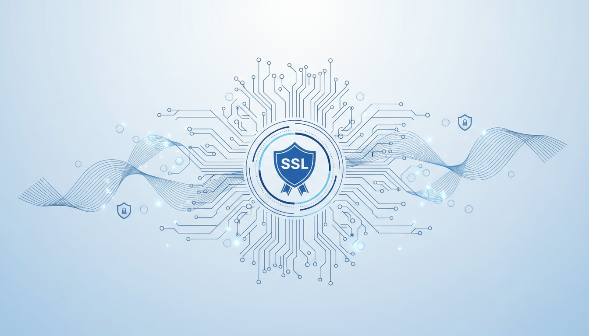

# Trellix ePO Self-Signed SSL Certificate Guide

[](https://opensource.org/licenses/MIT)
[](https://www.microsoft.com/microsoft-365/powerpoint)
[](https://www.trellix.com/products/epolicy-orchestrator/)
[](https://www.openssl.org/)

> A comprehensive, step-by-step technical presentation for creating and deploying self-signed SSL certificates for Trellix ePolicy Orchestrator (ePO) On-Prem servers.



---

## 📋 Table of Contents

- [Overview](#overview)
- [Key Features](#key-features)
- [Presentation Contents](#presentation-contents)
- [Prerequisites](#prerequisites)
- [Quick Start Commands](#quick-start-commands)
- [Installation](#installation)
- [Troubleshooting](#troubleshooting)
- [Security Best Practices](#security-best-practices)
- [Contributing](#contributing)
- [License](#license)
- [References](#references)

---

## 🎯 Overview

This presentation provides a complete guide for IT administrators and security professionals to create and install **self-signed SSL certificates** for Trellix ePO servers using OpenSSL. The method follows Trellix official documentation and industry best practices, ensuring secure certificate deployment with:

- ✅ Password-protected private keys (Triple DES encryption)
- ✅ 2048-bit RSA encryption (Trellix recommended)
- ✅ Subject Alternative Name (SAN) support for modern browsers
- ✅ Full compatibility with ePO 5.10.0 and newer versions

---

## ✨ Key Features

| Feature | Description |
|---------|-------------|
| **🔐 Secure** | Industry-standard 2048-bit RSA encryption with password protection |
| **📱 Compatible** | Works with Chrome, Edge, Firefox, and all modern browsers |
| **⚡ Quick Setup** | Complete deployment in ~40 minutes |
| **📚 Comprehensive** | 24 slides covering all aspects from installation to troubleshooting |
| **🎨 Professional Design** | Clean, modern visual style with high contrast code blocks |
| **🔍 Troubleshooting** | Common errors and solutions included |

---

## 📑 Presentation Contents

### Chapter 1: Overview & Prerequisites
- Why use self-signed certificates?
- Security features and benefits
- System requirements and prerequisites

### Chapter 2: OpenSSL Installation & Setup
- Downloading and installing OpenSSL (Win64 v3.6.1 Light)
- Creating folder structure
- OpenSSL configuration file with SAN support

### Chapter 3: Certificate Generation Process
- Generating password-protected private keys
- Creating self-signed certificates with SAN
- Converting to RSA traditional format
- Certificate verification

### Chapter 4: ePO Deployment & Verification
- Uploading certificates to ePO console
- Restarting ePO Application Server (3 methods)
- Importing certificates to browser trust store

### Chapter 5: Troubleshooting & Best Practices
- Common errors and solutions
- Quick reference commands
- Security best practices

---

## 🛠️ Prerequisites

| Component | Requirement |
|-----------|-------------|
| **ePO Server** | Trellix ePO On-Prem 5.10.0 or newer |
| **Operating System** | Windows Server 2016/2019/2022 |
| **OpenSSL** | Win64 OpenSSL v3.6.1 Light |
| **Access** | Administrator privileges |

### Download OpenSSL
```
https://slproweb.com/products/Win32OpenSSL.html
```

---

## ⚡ Quick Start Commands

### 1. Create Folder Structure
```cmd
mkdir C:\ssl
mkdir C:\ssl\certs
mkdir C:\ssl\keys
```

### 2. Generate Password-Protected Private Key
```cmd
"C:\Program Files\OpenSSL-Win64\bin\openssl.exe" genrsa -des3 -out C:\ssl\keys\ca.key 2048
```

### 3. Create Self-Signed Certificate with SAN
```cmd
"C:\Program Files\OpenSSL-Win64\bin\openssl.exe" req -new -x509 -days 365 -key C:\ssl\keys\ca.key -out C:\ssl\certs\ca.cer -config C:\ssl\openssl.cnf
```

### 4. Convert to RSA Format
```cmd
"C:\Program Files\OpenSSL-Win64\bin\openssl.exe" rsa -in C:\ssl\keys\ca.key -out C:\ssl\keys\ca-rsa.key -traditional
```

### 5. Verify Certificate
```cmd
"C:\Program Files\OpenSSL-Win64\bin\openssl.exe" x509 -in C:\ssl\certs\ca.cer -text -noout
```

### 6. Restart ePO Server
```cmd
net stop "McAfee ePolicy Orchestrator Application Server"
net start "McAfee ePolicy Orchestrator Application Server"
```

---

## 📥 Installation

### Step 1: Download the Presentation
```bash
git clone https://github.com/yourusername/trellix-epo-ssl-certificate-guide.git
cd trellix-epo-ssl-certificate-guide
```

### Step 2: Open the Presentation
Open `trellix_epo_ssl_certificate.pptx.html` in your browser or convert to PPTX format.

### Step 3: Follow the Guide
Work through each chapter systematically for successful certificate deployment.

---

## 🔧 Troubleshooting

### Common Errors

| Error | Cause | Solution |
|-------|-------|----------|
| "Private key file did not contain a valid private key" | Wrong key file format | Use `ca-rsa.key` (converted RSA format) |
| "NET::ERR_CERT_COMMON_NAME_INVALID" | Missing SAN in certificate | Ensure `openssl.cnf` has `[alt_names]` section |
| Browser shows "Not Secure" | Certificate not imported | Import to Trusted Root Certification Authorities |
| Certificate not updating | ePO not restarted | Restart ePO Application Server service |

### Diagnostic Tips
- ✅ Verify file paths are correct
- ✅ Check Administrator privileges
- ✅ Confirm ePO version compatibility
- ✅ Review OpenSSL installation path

---

## 🔒 Security Best Practices

1. **Keep Private Keys Secure** - Never share `ca.key` or `ca-rsa.key` files
2. **Use Strong Passphrase** - Minimum 12 characters with mixed types
3. **Limit File Access** - Restrict `C:\ssl\keys\` folder permissions
4. **Renew Before Expiry** - Certificate valid for 365 days
5. **Backup Files** - Keep secure backup in encrypted location
6. **Production Use** - Consider CA-signed certificates for external-facing environments

---

## 🤝 Contributing

Contributions are welcome! Please feel free to submit a Pull Request.

1. Fork the repository
2. Create your feature branch (`git checkout -b feature/AmazingFeature`)
3. Commit your changes (`git commit -m 'Add some AmazingFeature'`)
4. Push to the branch (`git push origin feature/AmazingFeature`)
5. Open a Pull Request

---

## 📄 License

This project is licensed under the MIT License - see the [LICENSE](LICENSE) file for details.

---

## 📚 References

- **Trellix Documentation:** [ePolicy Orchestrator 5.10.0 Product Guide](https://docs.trellix.com/)
- **OpenSSL Download:** [Win64 OpenSSL v3.6.1](https://slproweb.com/products/Win32OpenSSL.html)
- **Trellix KB Article:** KB72477 - How to generate a custom SSL certificate for use with ePO

---

## 👤 Author

**CyberSecLab**
- YouTube: [@CyberSecLabdev](https://youtube.com/@CyberSecLabdev)
- Website: [cybersecops.dev](https://cybersecops.dev)

---

## 🙏 Acknowledgments

- Trellix for official documentation and best practices
- OpenSSL community for the excellent toolkit
- IT administrators worldwide for feedback and improvements

---

<div align="center">

**[⬆ Back to Top](#trellix-epo-self-signed-ssl-certificate-guide)**

Made with ❤️ for the cybersecurity community

</div>
